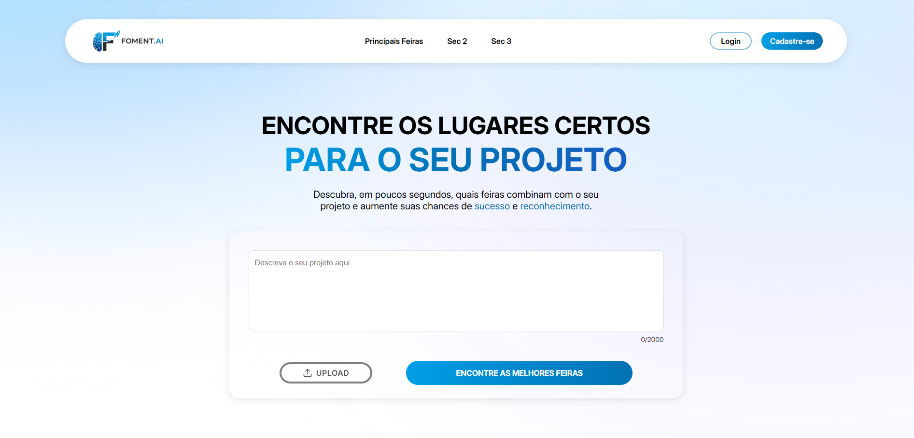

# Foment.AI

O Foment.AI é uma plataforma inteligente projetada para ajudar estudantes e pesquisadores a encontrar as feiras científicas e olimpíadas mais relevantes para seus projetos. Utilizando a API do Google Gemini, a aplicação analisa a descrição de um projeto e a compara com uma base de dados de eventos, fornecendo recomendações personalizadas para aumentar as chances de sucesso e reconhecimento.



## 🚀 Stack de Tecnologias

O projeto é dividido em três componentes principais:

- **Frontend (Interface do Usuário):**

  - **React.js** (com Vite)
  - **Axios** para requisições HTTP
  - **CSS Modules** para estilização

- **Backend de Análise (Python):**

  - **Flask** para a criação da API REST
  - **Pandas** para manipulação de dados a partir de arquivos CSV
  - **Google Generative AI (Gemini)** para a análise de relevância

- **Backend de Gerenciamento (Java - inferido):**
  - **Java** com **Spring Boot**
  - **JPA / Hibernate** para persistência de dados
  - **MySQL** como banco de dados

## ⚙️ Instalação

Siga os passos abaixo para configurar o ambiente de desenvolvimento em sua máquina local.

### Pré-requisitos

- [Node.js](https://nodejs.org/) (versão 18 ou superior)
- [Python](https://www.python.org/) (versão 3.9 ou superior)
- [Java Development Kit (JDK)](https://www.oracle.com/java/technologies/downloads/) (versão 17 ou superior)
- [MySQL](https://dev.mysql.com/downloads/mysql/)

---

### 1. Frontend (React)

```bash
# 1. Navegue até o diretório do frontend
cd frontend

# 2. Instale as dependências
npm install
```

### 2. Backend de Análise (Python)

```bash
# 1. Navegue até o diretório do backend Python
cd python/analisador_projetos

# 2. Instale as dependências
pip install Flask Flask-Cors pandas python-dotenv google-generativeai

# 3. Adicione sua chave da API do Gemini no arquivo .env
GEMINI_API_KEY="CHAVE DA API AQUI"
```

### 3. Backend de Gerenciamento (Java) e Banco de Dados

1.  **Crie o Banco de Dados:** Crie um banco de dados no MySQL chamado `Foment`.
2.  **Configure a Conexão:** No arquivo `backend/src/main/resources/application.properties`, ajuste as propriedades `spring.datasource.username` e `spring.datasource.password` com suas credenciais do MySQL.
3.  **Execute o Backend:** Importe o projeto em sua IDE (como IntelliJ ou VS Code) e execute a aplicação Spring Boot.

## ▶️ Executando a Aplicação

Para executar o projeto, você precisará iniciar os três serviços em terminais separados.

- **Frontend:**

  ```bash
  # No diretório 'frontend'
  npm run dev
  ```

  A aplicação estará disponível em `http://localhost:5173`.

- **Backend de Análise (Python):**

  ```bash
  # No diretório 'python/analisador_projetos'
  python script.py
  ```

  A API de análise estará disponível em `http://localhost:8000`.

- **Backend de Gerenciamento (Java):**
  - Execute a classe principal a partir da sua IDE ou use o Maven:
  ```bash
  # No diretório 'backend'
  mvn spring-boot:run
  ```
  A API de gerenciamento estará disponível em `http://localhost:8080`.
